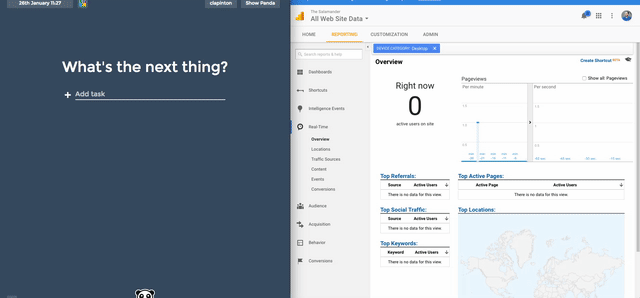
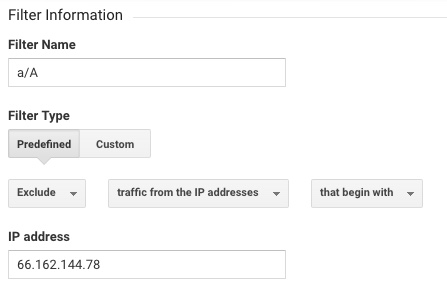

# Google Analytics Walkthrough

## What is Google Analytics? Why should I spend 5 minutes to set it up?
* It is a web traffic tracking system built by Google that is completely <b>FREE</b>
* Just create an account and put a piece of JavaScript tracking code into your site and it will run with every page of your site
* Once inserted into your code, the code records how long they were on your site, what device type they used, the number of page views, where they came from, etc.

## The ABCs of Google Analytics. You should be able to determine:
<b>A:</b> How many and which companies/recruiters/hiring managers are visiting my site? 
<b>B:</b> Am I creating content that is aesthetically appealing and easy to use for recruiters?  
<b>C:</b> Do I need to improve my site to increase callbacks from recruiters?

Google Analytics **does not** naturaly tell you who the person accessing your site is.  All information is anonymized bfore being displayed, so you can not view visits by IP or any other identifiable information. There are ways around that and we'll cover them ahead.

If you want to jump straight to implementation and figure out as you go, [go for it](#implementation).

If you want a bit more details on GA's functionality, read on.

## Comparing Full Stack Projects
For 6 weeks, we tracked students’ full stack projects and these were the results…
* The more applications a student sent out, the more website views it had that week
* Visitors are looking at your sites and staying on them for an average of 30-90 seconds
* Sites with easy guest login, awake dynos, and visually appealing sites have longer session durations (2 min+) and lower bounce rates (50%, which is a good thing!).  We’ve found correlation to shorter job search duration (limited data so far suggests ~23 days)
* Sites that are harder to navigate and take longer to load (dyno asleep, ~10 second page load) have a higher bounce rate (90%) and have a longer job search duration (60+ days)

## Case Study:
* A student added google analytics on her flex project during the time period of July 27-August 18, 2016.
* Her project was a video game stats website for Destiny. She shared the link on Reddit and it gained a lot of traction in the video game community resulting in the numbers you see below!
* Since her website gained such popularity, she was able to track many things about visitors to the website, where they were coming from, and how long they stayed on the site. She was even featured on GameRant. Check out her flex project [here] (https://destiny-data.herokuapp.com/#/?_k=jy5wf6).  
* Although most projects don’t attract this high a volume of users, this data may be useful to demonstrate how Google analytics is useful.

[Screenshot of her Google Analytics](http://imgur.com/a/KWL3h)

## GA's basic structure
There are 3 parts to a Google Analytics account:
* **Account:** You should have only one of these;
* **Property:** The sites you'll register. If you have more than one site that you want to track, and you want to track them sepeprately, you should create two separate properties. **Each property has its own tracking ID and snippet.**
* **View:** The information that gets displayed to you. For example, if you have two sites that don't need to be in different properties, you can instead create two views: one that displays data for curie.cats.com and the other for markov.cats.com. Make sure you always have one for "All Web Site Data", so you can have a broader picture of your site's usage.

You can create one property for each project if you want to. Just keep in mind that:
* you'll have to check 3 separate reports (FS, JS and Flex) if you want to see if a copmany you applied for clicked on any of your projects;
* Google limits the number of properties to 50 per account (kudos to you if you hit that limit)

For our purposes, we will keep all of our sites (FS, JS and flex projects) under one single property, since it's easier to track.

## Important interface pieces
Every time you land on the Google Analytics page, you will see an accounts list that has the page you just registered, as well as 4 tabs: 
* **Home**: Displays the accounts and sites you have;
* **Reporting**: The main reporting area, where are the graphs and stats are displayed;
* **Customization**: You can build customized reports from here. We will no be covering this section;
* **Admin**: Where you view the settings of your whole account (Account, Property and View).

## Analyzing your web traffic

### You are noise
You might see a big spike in usage all of a sudden. That might be you, working on a fix or new feature.
To counter that, GA allows us to filter traffic by IP. That will be our last step, as it's important to keep us unfiltered while we test the tracking code we'll be setting up.

### Audience overview, Acquisition overview, Behavior overview
[Watch This Video](https://www.youtube.com/watch?v=xZbd_yEN5nE) (9:16)  

We'll be focusing on 3 areas:
#### 1) Audience: Demographics, Browser, Mobile/Desktop and basic Behavior
As you start seeing numbers increase, it is important to know what these numbers mean:

* **Sessions**- a group of interactions that take place on your website within a given time frame. For example a single session may contain multiple screen or page views.
* **Users**- a user is a combination of a unique random number and the first time stamp. The first timestamp is the time of the first visit by a user or the time when the Google Analytics cookie was first set for the user.
* **Pageviews**- A pageview is defined as a view of a page on your site that is being tracked by the Analytics tracking code.          * If a user clicks reload after reaching the page, this is counted as an additional pageview.
* **Pages/session**- total duration of all sessions (in seconds) / number of sessions. Individual session duration is calculated differently depending on whether there are engagement hits on the last page of a session.
* **Bounce rate**- the percentage of single page visits (or web sessions). It is the number of visits in which a person leaves your website from the landing page without browsing any further.
* **% new sessions**- first time users visiting your website compared to visitors who have previously visited your site

#### 2) **Acquisition:** Where did people come from? This is where we'll see if that recruiter from Google visited your site.
We'll be leveraging **utm** parameters to help us track who's going to our sites. UTM's are parameters that you append to a site's URL that look like this:

[https://www.appacademy.io?utm_source=github&utm_medium=google-analytics-reading](https://www.appacademy.io?utm_source=github&utm_medium=google-analytics-reading)

There are 5 built in UTM params in Google Analytics and they'll automatically show up on your report when someone visits the link.

Here's one way to use these params. You're welcome to use them in any another way that you're more comfortable with. The goal is to make the final report clear to you:
* **utm_source:** We'll use it to specify `resume`, `email`, `cover-letter`, `linkedin`, `indeed` etc;
* **utm_medium:** We'll use it to specify `header`, `footer`, `body`, `linkedin-contact-info` etc;
* **utm_content** We'll use it to specify `company-name`, `recruiter-name` etc
* **utm_campaign, utm_term:** We won't be using these, but feel free to do so if you find it necessary. For example, you can use `utm_term` for the position title you're applying to.

#### 3) **Behavior:** Info on where are users going after they land, what are they clicking, which pages are being visited

##  How to Install and Set Up Google Analytics for your FSP/Javascript/Flex:
Setting up GA boils down to adding a JS snippet to your site:

* [Watch This Video](https://www.youtube.com/watch?v=Va-b-K5oqYs) (Only watch up to 3:00)
* After registering your site, copy and paste the Google Analytics snippet to your site, **before the closing `</head>` on your page**. The snippet should be present in whatever page you want to track. This means that:
    * If it is a **static site**, meaning there's only one HTML file to it, just place it on that single file;
    * If it is a **dynamic site**, like a Ruby+React SPA, you should make sure your code is in a central file, like the `/app/views/layouts/application.html.erb`. DO NOT copy paste the code on every single HTML/jsx file, since maintaining it becomes a nightmare.

* See if you didn't break the site on your local.
* Example of a student's project with Google Analytics inserted into the code: [Example 1](http://imgur.com/a/PXwI4)
* The snippets executes asynchronously, so it won't impact your page's performance.
* For more help, you can check out the [official Google docs](https://support.google.com/analytics/answer/1008080?hl=en).

That snippet will create a function calld `ga()`, which will be available for you as an API.

At a basic level, when a visitor enters the page, the snippet loads and automaticaly calls that function, passing in a `pageview` as a parameter, making GA log that visit.

Now that the snippet is set up, let's make sure it's working properly.

## First things first: Testing your tracking code
Click on the **Reporting** tab. Then expand the **Real-Time** section and click on **Overview**. You will see how many people are on your site at that moment. Now pop a new tab and go to your site. You should now see yourself on Google Analytics (it should take no more than 30 seconds for you to show up):

**Note: After you start sending out applications, recruiters and hiring managers should be clicking on your material. If you notice no one is visiting your site, you may have the code snippet in an invalid location in your code. Check its position and Chrome's console for any errors.**

**If you're still having issues, grab the [Tag Assistant](https://chrome.google.com/webstore/detail/tag-assistant-by-google/kejbdjndbnbjgmefkgdddjlbokphdefk?hl=en) Chrome extension to help you debug the problem.**

## Tracking a job application
So now that we have it all set up, it's time to send some applications.
First, let's build our URL. Notice that you should do this only once, and then copy-paste on other applications, changing only the `utm_content` or whatever parameter you're using to specify the company you're applying for.

* Go to [https://ga-dev-tools.appspot.com/campaign-url-builder/](https://ga-dev-tools.appspot.com/campaign-url-builder/) and fill out the small form;
* Grab the resulting link and put it on your application.

**@@@@ TALK ABOUT UTM @@@@**

## Filter out your own IP
Now that everything is set up, we can filter out our own IP. Don't forget to filter out both a/A's, your own home's IP and whatever other IP you work from:
* Go to the **Admin** tab;
* Under **View**, select **Filters** and then **+ ADD FILTER**;
* Create a new filter of **Predefined** and **Exclude** type and fill in the required params:

Make sure you get the correct public IP. Just Google "what's my ip" and you should see it.

Test that you don't show up anymore on the **Real-Time** report. If so, you're all set!

## Finding extra help
Back in 2013, Google launched the new version of Analytics called Universal Analytics (UA). The old one was the ga.js and is now flagged as legacy. All of Google's official docs for ga.js have a warning, but you might find older StackOverflow answers that are about ga.js. Make sure you're looking at the right version before trying to implement the answer you're looking at.